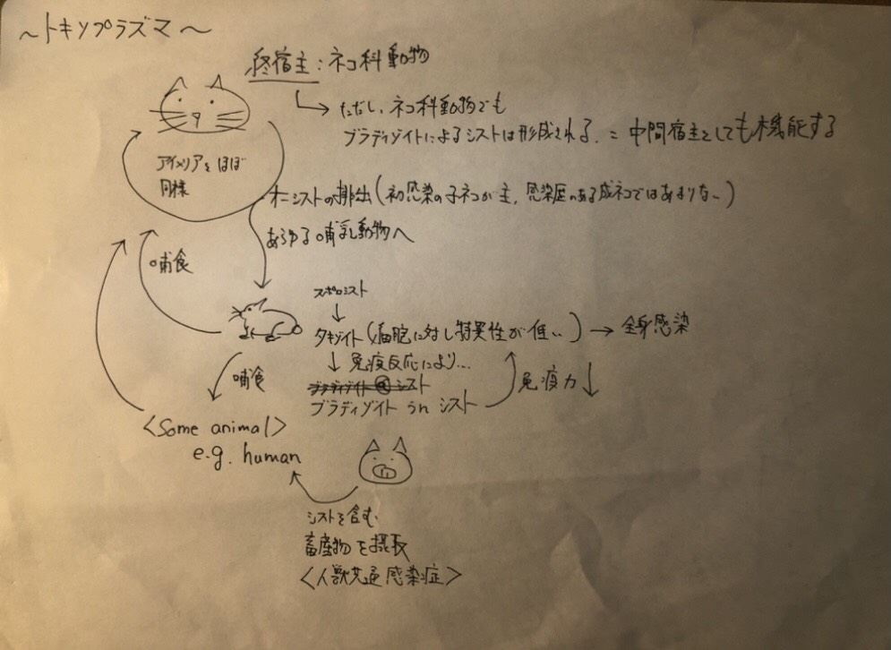

# アピコンプレックス類
1. グラガリナ類
1. コクシジウム類
    1. アガモコクシジウム類
    1. 原コクシジウム類
    1. 真コクシジウム類
        1. アデレア類
        1. アイメリア類
        1. 住血胞子虫類
1. ピロプラズマ類

これを医学・獣医学類において重要なものに限り簡略化すると

1. アデレア類
1. アイメリア類 (**教科書の目次におけるコクシジウム類はこれを指す**)
1. 住血胞子虫類
1. ピロプラズマ類

さらにアイメリア類のうち、アイメリア属(*Eimeria*属)とシストイソスポラ属(*Cystoisospora*属)を合わせて**コクシジウム**と呼称することがある。教科書の鶏のコクシジウム(p. 44)はこの意味で使われている。

## 鶏のコクシジウム = *Eimeria*属
*E.tenella*、*E.necatrix*、*E.maxima*、*E.acervulina*、*E.brunetti*の5種が重要。

### アイメリアの生活環
他のアビコンプレックス類を理解する上で基本となるので、押さえること。単一の宿主で生活環が成立することに注意。

1. 未成熟オーシストが糞便中に排出される。この時、**感染性はない**。
1. 数日後、成熟オーシスト(スポロゾイト形成オーシスト)となる。成熟オーシストは**4つのスポロシスト**に分かれ、それぞれに**2つのスポロゾイト**が含まれる。
1. 成熟オーシストが経口摂取によりとりこまれ、腸管内で脱殻する。スポロゾイトは腸管上皮細胞に侵入。
1. スポロゾイトは腸管癖にシゾント(メロント)を形成し、メロゾイトを多数形成する。
1. やがてシゾントは崩壊し、メロゾイトが腸管腔内に放出される。
1. メロゾイトは再度シゾントを形成し、4-5を複数回繰り返す

### 有性生殖
1. メロゾイトは分化し、新規の上皮細胞内で雌性配偶子のマクロガメトサイトと雄性配偶子のミクロガメトサイトとなる。
1. ミクロガメトサイトから出た多数のミクロガメートはマクロガメートと融合し、ザイゴートを形成する。
1. ザイゴートはやがてオーシストとなる。

### 主な寄生部位
*E.tenalla*は基本的に盲腸寄生だが、種により様々である。

### 補足
1. *E.tenalla*はシゾントが巨大 = 病原性が高い。
1. オーシストは耐久性が高いため、再発率が高い。熱による消毒が有効だが、現実的でない。
1. プレパテントピリオドは種により異なるが、4-5日程度と短い。

## 犬・猫のコクシジウム = *Cystoisospora*属
**2つのスポロシスト**に**4つのスポロゾイト**を持つオーシストが特徴。 生活環は*Eimeria*属と共通で一種類の宿主で循環する。

**しかし**、げっ歯類が待機宿主に位置し、**被鞘原虫(ユニゾイトシスト)** としてリンパ節・脾臓に存在する。ユニゾイトシストを有するげっ歯類を終宿主が捕食すると、感染する。**さらに**、リンパ節・脾臓に存在するユニゾイトシストは終宿主である犬・猫でも認められる。

## 牛、山羊、めんようのコクシジウム
鶏とほぼ同様の生活環と寄生部位。

## アイメリアか、シストイソスポラか
草食動物は*Eimeria*属、肉食獣は*Cystoisospora*属に感染する。豚は雑食なのでどちらにも感染する唯一の家畜として記憶する。ただしこの区別に科学的な相関はない。

## トキソプラズマ = *Toxoplasma gandii*
重要なのは*Toxoplasma gondii*のみ。

### 生活環
終宿主は**ネコ科動物**で、アイメリア属と類似した生活環を持つ。成熟オーシストはシストイソスポラ型である。

重要なのは、猫が感染歴の有無である。未感染猫(主に幼猫)は初感染から3-24日後にオーシストを糞便から排出し始め、10日間に渡り持続する。その後トキソプラズマは、中間宿主の場合と同様にシストを形成するブラディゾイトとして存在する。一方で感染歴のある猫(主に成猫)ではオーシストの排出は基本的にはない。

### もう一つの生活環
あらゆる哺乳動物、鳥類が中間宿主(待機宿主?)となる。終宿主あるいは待機宿主体内のスポロシストは**タキゾイト**として全身を循環し、細胞非特異的に感染する。免疫系の発動により、タキゾイトは**ブラディゾイト**として組織にシストを形成して、一生潜伏する。宿主の免疫力が低下すると、再度タキゾイトとして全身を循環し、病原性を発揮することがある。

中間宿主が中間宿主に捕食される、あるいは終宿主が中間宿主を捕食した場合、中間宿主内のシストも同時に経口摂取することとなり、ブラディゾイトが感染する。決して終宿主である猫のように、糞便を介した感染でないことに留意する。

### 人獣共通感染症として
トキソプラズマ病は家畜伝染病予防法において届出伝染病に指定されている(めん羊、山羊、豚、いのしし)ため、家畜からトキソプラズマが検出された場合は、と畜場法の規定によりと畜禁止、解体禁止もしくは全廃棄となる。

## ネオスポラ = *Neospora caninum*
重要なのは*Neospora caninum*のみ。*T.gondii*に類似の原虫だが、終宿主は**犬**である。待機宿主としては**牛**が重要で、流産の原因。垂直感染もする。

## ハモンディア = *Hammondia hammondi*
トキソプラズマのオーシストに類似。ただし糞便検査時に誤診する可能性があるが、そもそもトキソプラズマに糞便検査の適用はナンセンスなので、そんな心配しなくて良い。

## サルコシスティス = *Sarcocystis*属
### 生活環
生活環の形成に中間宿主を必要とする。終宿主から排泄される時はスポロゾイト形成オーシストとして排出される。すなわち成熟した状態で外界へ出る。

### 馬のサルコシスティス
*S. fevari*は毒素を産生し、非細菌性の食中毒の原因となる。

## クリプトスポリジウム = *Cryptosporidium*属
### 生活環
オーシスト中にスポロシストを形成しないため、成熟オーシストとして排出される。すなわち排泄された糞便は即座に感染性を有する。

### 寄生部位
腸管上皮細胞の微絨毛に寄生し、組織侵襲性は低いが、吸収が阻害されるため**水様性下痢**を起こす。
